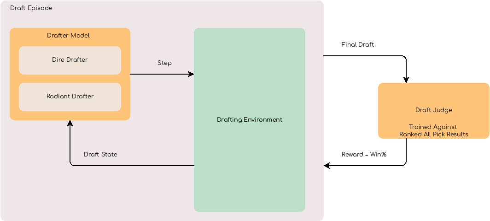

Drafting
========

A drafting environment is also provided for training networks specialized on drafting only without having to play
a full game of dota2

Note that without playing a game it is not possible to know which draft won, to remedy this a network
was trained to recognize winning drafts.

.. code-block:: python

    with Dota2DraftEnv() as env:

        while not env.done:
            # Get the draft state for each agent
            radiant, dire = env.action_space.sample()

            radiant = rad_pick, rad_ban
            dire = dire_pick, dire_ban

            # Make a drafting decision
            state, reward, done, info = env.step((radiant, dire))

.. automodule:: luafun.environment.draftenv
    :members:
    :undoc-members:
    :show-inheritance:

